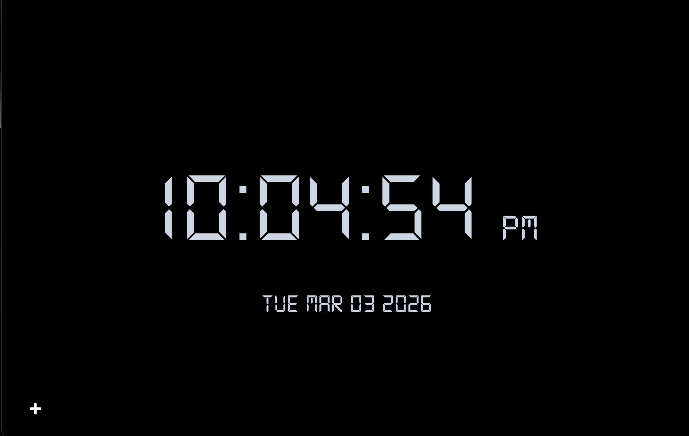

# 🕐 Basic Clock

A sleek, minimal web app built with React and TypeScript that brings together a **Digital Clock**, **Stopwatch**, and **World Clock** — all wrapped in a clean dark-themed UI.

---

## ✨ Features

- 🕰️ **Digital Clock** — Displays real-time hours, minutes, and seconds in a retro LCD font with AM/PM indicator and full date (e.g., `TUE MAR 03 2026`)
- ⏱️ **Stopwatch** — Precision stopwatch with millisecond accuracy, **Start/Stop**, **Reset**, and **Lap tracking** support
- 🌍 **World Clock** — Add and view clocks for multiple timezones worldwide using a timezone selector; auto-detects your current location

---

## 🛠️ Tech Stack

| Technology | Usage |
|---|---|
| ⚛️ React | Component-based UI |
| 🟦 TypeScript | Type-safe logic & components |
| 🔴 Redux | Global state management (stopwatch timer & lap logs) |
| 🌐 HTML5 | Markup |
| 🎨 CSS3 + Tailwind CSS | Styling & dark theme |
| ⚡ JavaScript | Page routing & utilities |
| 🔤 Digital-7 Font | Retro LCD clock display |

---

## 📸 Screenshots

### Digital Clock


---

## 🚀 Installation

Follow these steps to run the project locally:

### Prerequisites
- [Node.js](https://nodejs.org/) (v16 or above)
- npm or yarn

### Steps

```bash
# 1. Clone the repository
git clone https://github.com/ganeshedula/Basic_clock.git

# 2. Navigate into the project directory
cd Basic_clock

# 3. Install dependencies
npm install

# 4. Start the development server
npm start
```

The app will be available at `http://localhost:3000`

> To create a production build, run `npm run build`

---

## 📖 Usage

### 🕰️ Digital Clock
- Opens by default when you launch the app
- Automatically shows the **current time** and **date** based on your device's local time
- Uses the custom **Digital-7** font for an authentic LCD look

### ⏱️ Stopwatch
- Click **START** to begin timing
- Click **RESET** to reset the timer to `00:00:00.00`
- Lap times are recorded and displayed below the controls in alternating green/red colors
- Lap data is managed via **Redux** for reliable state handling

### 🌍 World Clock
- Click the **`+`** button (bottom-left) to open the timezone panel
- Select a timezone from the dropdown (auto-detects your current location)
- Click **Add Clock** to add it to your world clock display
- Timezone data is sourced from `src/services/data/timezones.json`

---

## 📁 Project Structure

```
└── 📁Basic_clock
    └── 📁public               # Static assets served by browser
    └── 📁src
        └── 📁assets
            └── 📁fonts        # Digital-7 custom font
            └── 📁images       # App icons/images
            └── 📁styles       # Global & component CSS files
        └── 📁components
            └── 📁clock        # Clock.tsx, DigitalClock.tsx, MainClock.tsx
            └── 📁navbar       # Navbar.tsx
            └── 📁stopwatch    # Timer, Actions, SplitTimer, LogTable
            └── 📁worldclock   # WorldClockCard, WorldClockMain
        └── 📁pages            # Clock.js, StopWatch.js, WorldClock.js, Error.js
        └── 📁services
            └── 📁constants    # App-wide constants
            └── 📁data         # timezones.json
            └── 📁redux
                └── 📁actions  # logAction.ts, timerActions.ts
                └── 📁reducers # timerReducer, logReducer, rootReducers
                ├── store.ts   # Redux store setup
            └── 📁utils        # cleanTime utility
            ├── types.ts       # Shared TypeScript types
        ├── App.tsx            # Root component & routing
        ├── index.tsx          # App entry point
    ├── tailwind.config.js
    ├── tsconfig.json
    └── package.json
```

---

## 🤝 Contributing

Contributions are welcome! Here's how you can help:

```bash
# 1. Fork the repository

# 2. Create your feature branch
git checkout -b feature/your-feature-name

# 3. Commit your changes
git commit -m "Add: your feature description"

# 4. Push to the branch
git push origin feature/your-feature-name

# 5. Open a Pull Request
```

Please make sure your code follows the existing style and is properly typed with TypeScript.

---

## 📄 License

This project is open source and available under the [MIT License](LICENSE).

---

> Made with ❤️ by [Ganesh Edula](https://github.com/ganeshedula)
